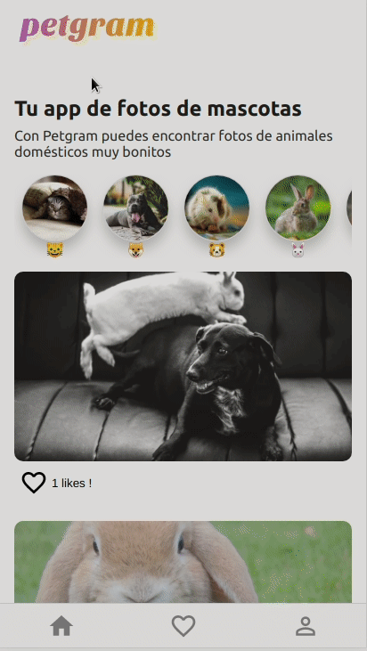

# Petgram 🐹 🐶 🐦 🐱 

### A pets social network 

A PWA where react-helmet is used for SEO and the new functionalities of react hooks such as useState, useMemo, useContext, lazy import are implemented.

It connects with an api that implements Graphql.

Css in JS is used with styled components.

#### Commands

- Runs the app in development mode : `npm run dev`
- Runs the app in production mode: `npm run serve:dev`
- Test E2E: `npm run cy:open` 

## Technologies ⚛️

- React
- Context api
- Styled-components
- React-helmet
- React-apollo
- Graphql
- Cypress
- PWA

Deployed with now : https://petgram.guusygonzalo.now.sh

## Demo 

